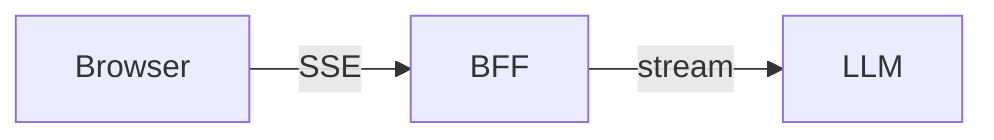
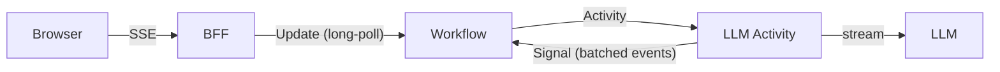
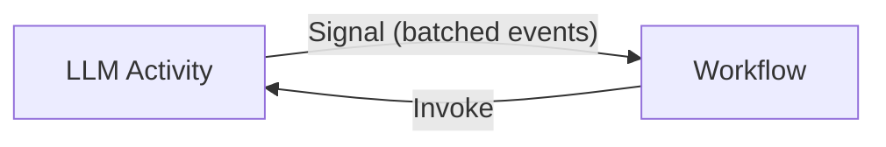
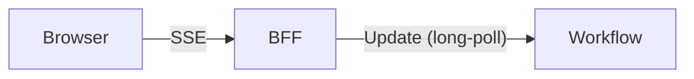
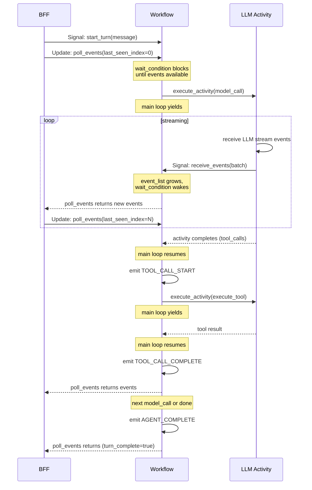

# Temporal Streaming Agents Samples

Sample applications demonstrating how to stream AI agent progress to users
through Temporal workflows. The samples use the OpenAI Responses API directly
(not an agent SDK) and show how to use Temporal's existing primitives —
Signals, Updates, and Queries — to deliver real-time streaming from durable
workflows, without additional infrastructure like Redis. The streaming patterns
generalize to any LLM provider with a streaming API.

## The Streaming Problem

Streaming means rendering agent progress as it happens rather than only when
the agent completes. AI agent streams commonly include:

- **LLM tokens**: Responses rendered incrementally as the model generates them.
- **Reasoning outputs**: Internal chain-of-thought exposed separately from the
  response.
- **Application messages**: Tool calls, status updates, agent handoffs, and
  other progress indicators originating from the application or from behind the
  model API (e.g., web search results).

Streaming keeps users engaged, builds trust through transparency, and enables
agent steering — cancelling unproductive work or interrupting to add context.
This is particularly important for long-running agents that do significant work
between interactions.

### Streaming and Durable Execution

A key question is the level of durability that is desirable — or achievable —
in streaming agentic applications.

Making state durable introduces latency and consumes system resources. If
failures are rare or consequences are low, durable streaming might not be
justified. But for production agents that run expensive multi-step workflows,
losing progress to a server restart or transient failure is costly.

The degree to which LLM calls are resumable mid-stream varies by provider.
OpenAI supports a fully resumable background mode. Google Interactions provides
access to end results of an interrupted stream once the call completes.
Anthropic's API accepts a response prefix that can resume a streaming response.
Some providers have no streaming recovery at all.

These samples demonstrate patterns that work regardless of whether the
underlying LLM API supports resumption.

## Architecture

### Without Temporal



The BFF (backend-for-frontend) runs the agent loop, buffers events in memory,
and streams them to the browser via SSE. If the server restarts, all in-flight
work and session state is lost.

### With Temporal



The BFF becomes a stateless proxy. Session state, conversation history, and
the event stream all live in the workflow. The BFF can be restarted at any time
without losing work.

There are two streaming transport problems to solve:

1. **Activity → Workflow**: How does the LLM activity send streaming events
   (tokens, thinking, tool calls) back to the workflow while the activity is
   still running?
2. **Workflow → BFF**: How does the BFF receive those events from the workflow
   to forward as SSE to the browser?

### Transport: Activity → Workflow (Batched Signals)



The LLM activity streams the model response using the OpenAI Responses API
(`openai.responses.stream()`). The pattern generalizes to any LLM provider
with a streaming API. As events arrive, the activity translates them into
application events and buffers them. A background timer flushes the buffer to
the workflow via a Temporal Signal at a configurable interval (default:
2 seconds).

This is a Nagle-like batching strategy: buffer events, flush on a timer. The
activity can also flush immediately for significant events (e.g., end of a
thinking block).

```python
class EventBatcher:
    """Buffers events and flushes to the workflow via Signal."""

    def __init__(self, handle, signal_name, interval=2.0):
        self._handle = handle
        self._signal_name = signal_name
        self._interval = interval
        self._buffer: list[dict] = []

    def add(self, event: dict):
        self._buffer.append(event)

    async def flush(self):
        if self._buffer:
            batch = self._buffer.copy()
            self._buffer.clear()
            await self._handle.signal(self._signal_name, ActivityEventsInput(events=batch))

    async def run_flusher(self):
        while True:
            await asyncio.sleep(self._interval)
            await self.flush()
```

The activity runs the stream reader and the timer flusher as concurrent tasks:

```python
@activity.defn
async def model_call(input: ModelCallInput) -> ModelCallResult:
    batcher = EventBatcher(workflow_handle, "receive_events", interval=2.0)

    async def read_stream():
        async with openai_client.responses.stream(**kwargs) as stream:
            async for event in stream:
                activity.heartbeat()
                batcher.add(translate(event))

    # Run stream + timer concurrently; cancel timer when stream completes
    completed, pending = await asyncio.wait(
        [asyncio.create_task(read_stream()),
         asyncio.create_task(batcher.run_flusher())],
        return_when=asyncio.FIRST_COMPLETED,
    )
    for t in pending:
        t.cancel()
    await batcher.flush()  # final flush

    return ModelCallResult(...)
```

The workflow receives batched events via a Signal handler and appends them to
its durable event list:

```python
@workflow.signal
def receive_events(self, input: ActivityEventsInput) -> None:
    self._event_list.extend(input.events)
```

**Why Signals?** Signals are fire-and-forget — the activity does not block
waiting for a response. They are delivered reliably by Temporal and processed
in order. The batching amortizes the cost: at 2-second intervals, a typical
model call generates 3-5 signal deliveries rather than hundreds of individual
token events.

### Transport: Workflow → BFF (Long-Poll Updates)



The BFF polls the workflow for new events using Temporal Updates. Each poll
includes the client's `last_seen_index`. The Update handler uses
`workflow.wait_condition()` to block until new events are available, then
returns them.

```python
@workflow.update
async def poll_events(self, input: PollEventsInput) -> PollEventsResult:
    await workflow.wait_condition(
        lambda: len(self._event_list) > input.last_seen_index
            or self._turn_complete,
        timeout=300,
    )
    return PollEventsResult(
        events=self._event_list[input.last_seen_index:],
        turn_complete=self._turn_complete,
    )
```

The BFF converts each batch into SSE and writes to the HTTP response:

```python
async def event_stream():
    last_index = start_index
    while True:
        result = await handle.execute_update(
            AnalyticsWorkflow.poll_events,
            PollEventsInput(last_seen_index=last_index),
        )
        for event in result.events:
            yield f"data: {json.dumps(event)}\n\n"
            last_index += 1
        if result.turn_complete:
            return

return StreamingResponse(event_stream(), media_type="text/event-stream")
```

**Why `wait_condition`?** It yields control in the workflow's event loop,
allowing the main agent loop to continue making progress. When a Signal arrives
with new events, the condition wakes up, and the Update handler returns the
batch. This interleaving is what makes long-polling work without dedicated
pub/sub infrastructure.

**Why not WebSockets?** WebSockets are a viable alternative where the workflow
pushes to the BFF rather than the BFF pulling. This avoids the overhead of
repeated Updates but requires the workflow to manage connection state. The
long-poll approach is simpler and works well for the latencies typical of AI
agent interactions (seconds, not milliseconds).

### Concurrency Model

The workflow runs a main loop and handles poll Updates concurrently on a single
thread. The key insight is that `workflow.wait_condition()` yields, so the main
loop and poll handlers interleave at each `await` point:



### Per-Turn Event Indexing

Events use a global index that increments across all turns within a session.
Before sending the `start_turn` Signal, the BFF queries the current event
count. The SSE stream starts from that index, ensuring only events from the
current turn are sent — not replayed events from prior turns.

```python
# BFF: start a turn
start_index = await handle.query(AnalyticsWorkflow.get_event_count)
await handle.signal(AnalyticsWorkflow.start_turn, StartTurnInput(message=text))
# Poll from start_index onward...
```

On reconnect (even after server restart), the client resumes from its last
known index. The workflow has all events durably.

## Analytics Agent

Chat-based analytics agent that queries a Chinook music store database
(SQLite). The agent writes and executes SQL queries, Python code, and shell
commands, reasons about results, recovers from errors, and presents formatted
analysis.

See [backend-temporal/ARCHITECTURE.md](backend-temporal/ARCHITECTURE.md) for
implementation details including event types, failure modes, and recovery
behavior.

### Testing

Unit tests cover pure logic (reducers, event serialization, tool guards, Pydantic
types). E2E tests hit the real OpenAI API through Playwright.

```bash
# Frontend unit tests (Vitest)
cd frontend && npx vitest run

# Backend-ephemeral unit tests (pytest)
cd backend-ephemeral && uv run python -m pytest tests/ --timeout=30

# Backend-temporal unit tests (pytest)
cd backend-temporal && uv run python -m pytest tests/ --timeout=30

# E2E tests (Playwright, requires OPENAI_API_KEY)
npx playwright test
```

E2E tests auto-start the ephemeral backend and frontend via Playwright's
`webServer` config. They skip if `OPENAI_API_KEY` is not set.

### Prerequisites

- Python 3.12+
- Node.js 18+
- [uv](https://docs.astral.sh/uv/) (Python package manager)
- [Temporal CLI](https://docs.temporal.io/cli) (`brew install temporal` on macOS)
- OpenAI API key (full-access, or a restricted key with Write access to `/v1/responses`)

### Setup

```bash
# Download the Chinook SQLite database
./setup.sh

# Install backend dependencies
(cd backend-temporal && uv sync)

# Install frontend dependencies
(cd frontend && npm install)
```

### Running

```bash
# Terminal 1: Temporal dev server
temporal server start-dev

# Terminal 2: Worker
# Note: this sample uses the OpenAI Responses API with gpt-4.1. A full-access
# project key works, or a restricted key with Write permission for /v1/responses.
# Read-only keys will fail. No permissions for Assistants or OpenAI-hosted tools
# are required.
export OPENAI_API_KEY=sk-...
cd backend-temporal
uv run python -m src.worker

# Terminal 3: FastAPI proxy (port 8001)
cd backend-temporal
uv run uvicorn src.main:app --reload --port 8001

# Terminal 4: Frontend (port 3001)
cd frontend
npm run dev
```

Open http://localhost:3001

### Running (Ephemeral Backend)

An ephemeral (non-Temporal) backend is included for comparison. It runs the
same agent with the same frontend but keeps all state in memory.

```bash
# Terminal 1: Backend (port 8001)
# Note: this sample uses the OpenAI Responses API with gpt-4.1. A full-access
# project key works, or a restricted key with Write permission for /v1/responses.
# Read-only keys will fail. No permissions for Assistants or OpenAI-hosted tools
# are required.
export OPENAI_API_KEY=sk-...
cd backend-ephemeral
uv sync
uv run uvicorn src.main:app --reload --port 8001

# Terminal 2: Frontend (port 3001)
cd frontend
npm run dev
```

### Demo Script

#### 1. Basic SQL Query

Click **"Show me the top 10 customers by total spending"** from the suggested prompts.

**Watch for:**
- User message appears right-aligned in purple
- "Running SQL..." step appears with timer, then completes as "Executed SQL"
- Click the SQL step to expand it — shows the query with syntax highlighting and the raw result
- Markdown table streams in with 10 customer rows
- Summary text follows the table

#### 2. Cross-Tabulation (Multi-Step)

Type: **"Create a cross-tabulation of genres vs countries — which countries prefer which genres? Show the top 5 genres and top 5 countries by purchase volume."**

**Watch for:**
- Multiple SQL execution steps (the agent may query data in stages)
- Final output: a crosstab table with genres as columns, countries as rows
- Insights about the data below the table

#### 3. Parallel SQL Queries

Type: **"I want three things: (1) the top 5 artists by total revenue, (2) the top 5 genres by track count, and (3) the average invoice total by country. Get all three."**

**Watch for:**
- Multiple "Running SQL..." steps appear simultaneously (parallel execution)
- Steps complete independently
- Final output synthesizes all three results into separate tables

#### 4. Multi-Turn Conversation

After the previous query, type: **"Now show me the top 3 albums for Iron Maiden specifically"**

**Watch for:**
- Agent uses context from the previous turn ("Iron Maiden" appeared in the results)
- Returns specific album data for that artist

#### 5. Bash Tool (Write + Run Script)

Start a new session (click **+ New chat** in the sidebar), then type: **"Write a Python script that generates a summary report of the database and save it to report.py, then run it"**

**Watch for:**
- "Running bash..." steps for writing and executing the script
- If the script errors (e.g., wrong DB path), the agent reasons about the error and retries
- Tell it: **"Use the DB_PATH environment variable to find the database"**
- Final output shows the report with table summaries

#### 6. Session Management

- Click **+ New chat** to create a new session
- Each session has its own conversation history and backend state
- Click any session in the sidebar to switch back — the full conversation is preserved
- Session previews update to show the first message

#### 7. Interrupt

Type a broad query like: **"Give me a detailed breakdown of every customer's purchase history including all invoices and line items"**

While the agent is working, press **Esc**.

**Watch for:**
- Stream stops immediately
- Any partial output remains visible
- Input returns to idle ("Ask anything...")
- You can send a new message

#### 8. Queue Follow-Up

Send any query. While the agent is running, type a follow-up and press Enter.

**Watch for:**
- Input placeholder says "Type to steer the agent or queue a follow-up"
- First query completes normally
- Queued message is sent automatically as the next turn
