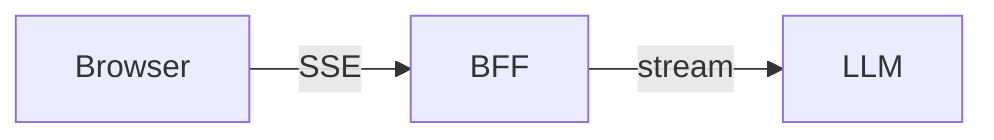
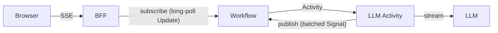
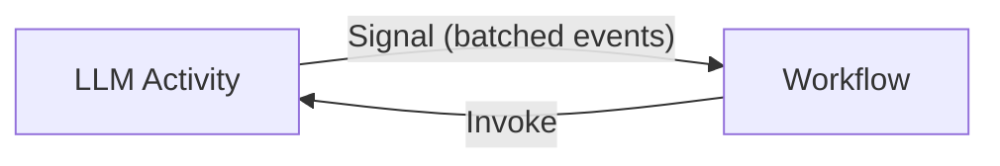
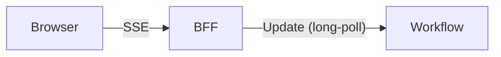
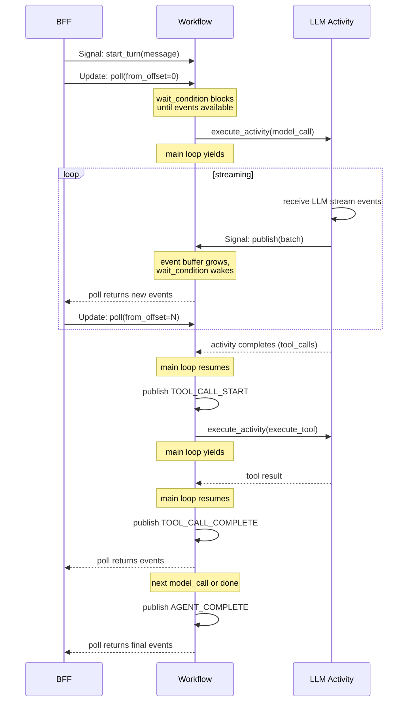

# Temporal Streaming Agents Samples

Sample applications demonstrating how to stream AI agent progress to users
through Temporal workflows. The samples use the OpenAI Responses API directly
(not an agent SDK) and show how to use Temporal's existing primitives —
Signals, Updates, and Queries — to deliver real-time streaming from durable
workflows, without additional infrastructure like Redis. The streaming patterns
generalize to any LLM provider with a streaming API.

## The Streaming Problem

Streaming means rendering agent progress as it happens rather than only when
the agent completes. AI agent streams commonly include:

- **LLM tokens**: Responses rendered incrementally as the model generates them.
- **Reasoning outputs**: Internal chain-of-thought exposed separately from the
  response.
- **Application messages**: Tool calls, status updates, agent handoffs, and
  other progress indicators originating from the application or from behind the
  model API (e.g., web search results).

Streaming keeps users engaged, builds trust through transparency, and enables
agent steering — cancelling unproductive work or interrupting to add context.
This is particularly important for long-running agents that do significant work
between interactions.

### Streaming and Durable Execution

A key question is the level of durability that is desirable — or achievable —
in streaming agentic applications.

Making state durable introduces latency and consumes system resources. If
failures are rare or consequences are low, durable streaming might not be
justified. But for production agents that run expensive multi-step workflows,
losing progress to a server restart or transient failure is costly.

The degree to which LLM calls are resumable mid-stream varies by provider.
OpenAI supports a fully resumable background mode. Google Interactions provides
access to end results of an interrupted stream once the call completes.
Anthropic's API accepts a response prefix that can resume a streaming response.
Some providers have no streaming recovery at all.

These samples demonstrate patterns that work regardless of whether the
underlying LLM API supports resumption.

## Architecture

### Without Temporal



The BFF (backend-for-frontend) runs the agent loop, buffers events in memory,
and streams them to the browser via SSE. If the server restarts, all in-flight
work and session state is lost.

### With Temporal



The BFF becomes a stateless proxy. Session state, conversation history, and
the event stream all live in the workflow. The BFF can be restarted at any time
without losing work.

The streaming transport uses `temporalio.contrib.pubsub` — a reusable module
that handles batched publishing from activities, durable storage in the
workflow, and long-poll subscription from external clients. There are two
directions:

1. **Activity → Workflow (publish)**: The activity publishes streaming events
   (thinking deltas, text deltas, retries) via `PubSubClient`. Events are
   batched and flushed to the workflow via Signal at a configurable interval.
   The workflow itself publishes lifecycle events (tool calls, agent
   start/complete, token usage) directly via `self.publish()`.
2. **Workflow → BFF (subscribe)**: The BFF subscribes via `PubSubClient`,
   which long-polls the workflow using Updates. The Update handler blocks with
   `wait_condition` until new events are available.

### Transport: Activity → Workflow (Pub/Sub)



The LLM activity streams the model response using the OpenAI Responses API
(`openai.responses.stream()`). The pattern generalizes to any LLM provider
with a streaming API. As events arrive, the activity translates them into
application events and publishes them through `PubSubClient` from
`temporalio.contrib.pubsub`. The client batches events and flushes them to
the workflow via Signal at a configurable interval (default: 2 seconds).

This is a Nagle-like batching strategy: buffer events, flush on a timer. The
client can also flush immediately for priority events (e.g., end of a thinking
block).

```python
@activity.defn
async def model_call(input: ModelCallInput) -> ModelCallResult:
    pubsub = PubSubClient.create(batch_interval=2.0)

    async with pubsub:
        async with openai_client.responses.stream(**kwargs) as stream:
            async for event in stream:
                activity.heartbeat()
                pubsub.publish(EVENTS_TOPIC, translate(event))
                # Priority flush for significant events
                if is_thinking_complete(event):
                    pubsub.publish(EVENTS_TOPIC, payload, priority=True)

    return ModelCallResult(...)
```

The `async with pubsub` context manager starts the background flush timer and
guarantees a final flush on exit — no manual `asyncio.wait()` or cancellation
logic needed.

The workflow extends `PubSubMixin`, which provides the Signal handler, Update
handler, and Query handler for the event stream:

```python
@workflow.defn
class AnalyticsWorkflow(PubSubMixin):
    @workflow.init
    def __init__(self, state: WorkflowState) -> None:
        self.init_pubsub(prior_state=state.pubsub_state)
```

The workflow publishes events directly too (for events that originate in the
workflow, like tool call start/complete):

```python
def _emit(self, event_type: str, **data) -> None:
    event = {"type": event_type, "timestamp": workflow.now().isoformat(), "data": data}
    self.publish(EVENTS_TOPIC, json.dumps(event).encode())
```

### Transport: Workflow → BFF (Pub/Sub Subscribe)



The BFF subscribes to the workflow's event stream using
`PubSubClient.subscribe()`, an async iterator that long-polls the workflow via
Updates internally. Each poll includes the client's current offset. The
Update handler in `PubSubMixin` uses `workflow.wait_condition()` to block
until new events are available, then returns them.

```python
pubsub = PubSubClient.create(client, session_id)
start_offset = await pubsub.get_offset()

async def event_stream():
    async for item in pubsub.subscribe(
        topics=[EVENTS_TOPIC], from_offset=start_offset
    ):
        event = json.loads(item.data)
        yield f"data: {json.dumps(event)}\n\n"
        if event.get("type") == "AGENT_COMPLETE":
            return

return StreamingResponse(event_stream(), media_type="text/event-stream")
```

The subscribe iterator handles the poll loop, offset tracking, and
reconnection internally. The BFF code is a simple async for loop.

### Concurrency Model

The workflow runs a main loop and handles pub/sub poll Updates concurrently on
a single thread. The key insight is that `workflow.wait_condition()` yields, so
the main loop and poll handlers interleave at each `await` point:



### Per-Turn Event Indexing

Events use a global offset that increments across all turns within a session.
Before sending the `start_turn` Signal, the BFF queries the current pub/sub
offset. The SSE stream starts from that offset, ensuring only events from the
current turn are sent — not replayed events from prior turns.

```python
# BFF: start a turn
pubsub = PubSubClient.create(client, session_id)
start_offset = await pubsub.get_offset()
await handle.signal(AnalyticsWorkflow.start_turn, StartTurnInput(message=text))
# Subscribe from start_offset onward...
```

On reconnect (even after server restart), the client resumes from its last
known offset. The workflow has all events durably.

## Analytics Agent

Chat-based analytics agent that queries a Chinook music store database
(SQLite). The agent writes and executes SQL queries, Python code, and shell
commands, reasons about results, recovers from errors, and presents formatted
analysis.

See [backend-temporal/ARCHITECTURE.md](backend-temporal/ARCHITECTURE.md) for
implementation details including event types, failure modes, and recovery
behavior.

### Testing

Unit tests cover pure logic (reducers, event serialization, tool guards, Pydantic
types). E2E tests hit the real OpenAI API through Playwright.

```bash
# Frontend unit tests (Vitest)
cd frontend && npx vitest run

# Backend-ephemeral unit tests (pytest)
cd backend-ephemeral && uv run python -m pytest tests/ --timeout=30

# Backend-temporal unit tests (pytest)
cd backend-temporal && uv run python -m pytest tests/ --timeout=30

# E2E tests (Playwright, requires OPENAI_API_KEY)
npx playwright test
```

E2E tests auto-start the ephemeral backend and frontend via Playwright's
`webServer` config. They skip if `OPENAI_API_KEY` is not set.

### Prerequisites

- Python 3.12+
- Node.js 18+
- [uv](https://docs.astral.sh/uv/) (Python package manager)
- [Temporal CLI](https://docs.temporal.io/cli) (`brew install temporal` on macOS)
- OpenAI API key (full-access, or a restricted key with Write access to `/v1/responses`)

### Setup

```bash
# Download the Chinook SQLite database
./setup.sh

# Install backend dependencies
(cd backend-temporal && uv sync)

# Install frontend dependencies
(cd frontend && npm install)
```

### Running

```bash
# Terminal 1: Temporal dev server
temporal server start-dev

# Terminal 2: Worker
# Note: this sample uses the OpenAI Responses API (default model: gpt-5.4-mini).
# A full-access project key works, or a restricted key with Write permission
# for /v1/responses. Read-only keys will fail. No permissions for Assistants
# or OpenAI-hosted tools are required.
export OPENAI_API_KEY=sk-...
cd backend-temporal
uv run python -m src.worker

# Terminal 3: FastAPI proxy (port 8001)
cd backend-temporal
uv run uvicorn src.main:app --reload --port 8001

# Terminal 4: Frontend (port 3001)
cd frontend
npm run dev
```

Open http://localhost:3001

### Running (Temporal Cloud)

To run against Temporal Cloud instead of a local dev server, create a
`backend-temporal/.env` file:

```bash
TEMPORAL_ADDRESS=your-namespace.abcd.tmprl.cloud:7233
TEMPORAL_NAMESPACE=your-namespace.abcd
TEMPORAL_API_KEY=your-api-key
OPENAI_API_KEY=sk-...
```

Then start the worker, API server, and frontend as above — but skip the
`temporal server start-dev` step. The worker and API server read connection
settings from the `.env` file automatically.

To create an API key, go to [cloud.temporal.io](https://cloud.temporal.io) →
profile → **API Keys** → **Create API Key**.

### Running (Ephemeral Backend)

An ephemeral (non-Temporal) backend is included for comparison. It runs the
same agent with the same frontend but keeps all state in memory.

```bash
# Terminal 1: Backend (port 8001)
# Note: this sample uses the OpenAI Responses API (default model: gpt-5.4-mini).
# A full-access project key works, or a restricted key with Write permission
# for /v1/responses. Read-only keys will fail. No permissions for Assistants
# or OpenAI-hosted tools are required.
export OPENAI_API_KEY=sk-...
cd backend-ephemeral
uv sync
uv run uvicorn src.main:app --reload --port 8001

# Terminal 2: Frontend (port 3001)
cd frontend
npm run dev
```

### Demo Script

#### 1. Basic SQL Query

Click **"Show me the top 10 customers by total spending"** from the suggested prompts.

**Watch for:**
- User message appears right-aligned in purple
- "Running SQL..." step appears with timer, then completes as "Executed SQL"
- Click the SQL step to expand it — shows the query with syntax highlighting and the raw result
- Markdown table streams in with 10 customer rows
- Summary text follows the table

#### 2. Cross-Tabulation (Multi-Step)

Type: **"Create a cross-tabulation of genres vs countries — which countries prefer which genres? Show the top 5 genres and top 5 countries by purchase volume."**

**Watch for:**
- Multiple SQL execution steps (the agent may query data in stages)
- Final output: a crosstab table with genres as columns, countries as rows
- Insights about the data below the table

#### 3. Parallel SQL Queries

Type: **"I want three things: (1) the top 5 artists by total revenue, (2) the top 5 genres by track count, and (3) the average invoice total by country. Get all three."**

**Watch for:**
- Multiple "Running SQL..." steps appear simultaneously (parallel execution)
- Steps complete independently
- Final output synthesizes all three results into separate tables

#### 4. Multi-Turn Conversation

After the previous query, type: **"Now show me the top 3 albums for Iron Maiden specifically"**

**Watch for:**
- Agent uses context from the previous turn ("Iron Maiden" appeared in the results)
- Returns specific album data for that artist

#### 5. Bash Tool (Write + Run Script)

Start a new session (click **+ New chat** in the sidebar), then type: **"Write a Python script that generates a summary report of the database and save it to report.py, then run it"**

**Watch for:**
- "Running bash..." steps for writing and executing the script
- If the script errors (e.g., wrong DB path), the agent reasons about the error and retries
- Tell it: **"Use the DB_PATH environment variable to find the database"**
- Final output shows the report with table summaries

#### 6. Session Management

- Click **+ New chat** to create a new session
- Each session has its own conversation history and backend state
- Click any session in the sidebar to switch back — the full conversation is preserved
- Session previews update to show the first message

#### 7. Interrupt

Type a broad query like: **"Give me a detailed breakdown of every customer's purchase history including all invoices and line items"**

While the agent is working, press **Esc**.

**Watch for:**
- Stream stops immediately
- Any partial output remains visible
- Input returns to idle ("Ask anything...")
- You can send a new message

#### 8. Queue Follow-Up

Send any query. While the agent is running, type a follow-up and press Enter.

**Watch for:**
- Input placeholder says "Type to steer the agent or queue a follow-up"
- First query completes normally
- Queued message is sent automatically as the next turn
