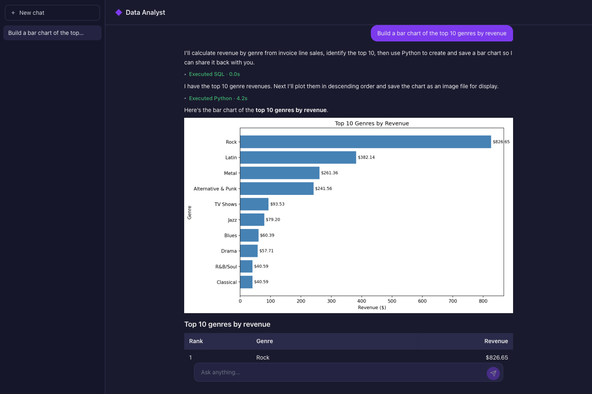

# Workflow Streams Demos

Full-stack AI agent demos built on [Workflow Streams](https://docs.temporal.io/develop/python/libraries/workflow-streams),
Temporal's durable streaming abstraction (public preview, ships in `temporalio>=1.27.0`).
An analytics chat agent on the web and a voice agent in the terminal, both
streaming live tokens, reasoning, tool calls, and charts straight off a durable
Workflow.



## Quickstart

You need Python 3.12+, Node.js 18+, [`uv`](https://docs.astral.sh/uv/), the
[Temporal CLI](https://docs.temporal.io/cli) (`brew install temporal` on macOS),
and an OpenAI API key.

```bash
git clone https://github.com/jssmith/workflow-streams-demos
cd workflow-streams-demos
export OPENAI_API_KEY=sk-...
scripts/run-demo.sh analytics
```

Then open <http://localhost:3001>.

`run-demo.sh` does the rest: it downloads the sample database, runs `uv sync`,
installs frontend dependencies, starts a local `temporal server start-dev` if
one isn't already running, and brings up the worker, BFF, and frontend. Ctrl+C
tears down only what it started.

For the voice agent:

```bash
scripts/run-demo.sh voice
```

The script prints the client command to run in a second terminal.

## Demos

### `apps/backend-temporal` — Analytics chat agent (web)

A chat UI over the Chinook music store database. The agent has SQL, Python, and
bash tools and writes results back as a streaming response with markdown tables
and embedded charts. Each session is a durable Workflow; the FastAPI
backend-for-frontend is a stateless SSE proxy that subscribes to the Workflow
stream and resumes from the client's last-seen offset on reconnect.

See [`apps/backend-temporal/ARCHITECTURE.md`](apps/backend-temporal/ARCHITECTURE.md).

### `apps/voice-terminal` — Voice agent (terminal)

Spoken queries against the same database. Each turn is a Workflow; transcribe,
model call, and SQL execution are Activities. TTS audio streams back
sentence-by-sentence over the Workflow stream. Continue-as-new with per-turn
truncation keeps the durable history bounded across long conversations.

See [`apps/voice-terminal/ARCHITECTURE.md`](apps/voice-terminal/ARCHITECTURE.md).

### `apps/backend-ephemeral` — Same agent, no Temporal

A drop-in non-Temporal backend for the analytics frontend. Same agent loop,
in-memory sessions, no durability. Useful for seeing what running on Temporal
buys you.

## Running against Temporal Cloud

Drop `TEMPORAL_ADDRESS`, `TEMPORAL_NAMESPACE`, and `TEMPORAL_API_KEY` into
`apps/backend-temporal/.env`. `run-demo.sh` honors it and prints which cluster
it connected to; otherwise everything points at `localhost:7233`.

## Running by hand

```bash
temporal server start-dev                                          # terminal 1

cd apps/backend-temporal                                           # terminal 2
export OPENAI_API_KEY=sk-...
uv run python -m src.worker

cd apps/backend-temporal                                           # terminal 3
uv run uvicorn src.main:app --reload --port 8001

cd apps/frontend && npm run dev                                    # terminal 4
```

For the ephemeral comparison, replace terminals 2 and 3 with a single
`(cd apps/backend-ephemeral && uv run uvicorn src.main:app --reload --port 8001)`.

First time only: `./setup.sh && uv sync --all-packages && (cd apps/frontend && npm install)`.

## Layout

```
apps/
  backend-temporal/      Analytics agent: workflow + activities + FastAPI BFF
  backend-ephemeral/     Same agent without Temporal (in-memory)
  voice-terminal/        Voice agent: workflow + activities + terminal client
  frontend/              Next.js app shared by both backends
packages/shared/         Chinook DB access, SQL tool, common types
scripts/                 run-demo.sh and friends
```

## Tests

```bash
(cd apps/voice-terminal     && uv run python -m pytest tests/ --timeout=60)
(cd apps/backend-temporal   && uv run python -m pytest tests/ --timeout=30)
(cd apps/backend-ephemeral  && uv run python -m pytest tests/ --timeout=30)
(cd apps/frontend           && npx vitest run)
```

End-to-end Playwright suites under `tests/e2e/` and `playwright.temporal.config.ts`
need a running Temporal cluster and an `OPENAI_API_KEY`.

## See also

- [Workflow Streams documentation](https://docs.temporal.io/develop/python/libraries/workflow-streams) — API and semantics.
- [samples-python/workflow_streams](https://github.com/temporalio/samples-python/tree/main/workflow_streams) — minimal, feature-focused scenarios.
